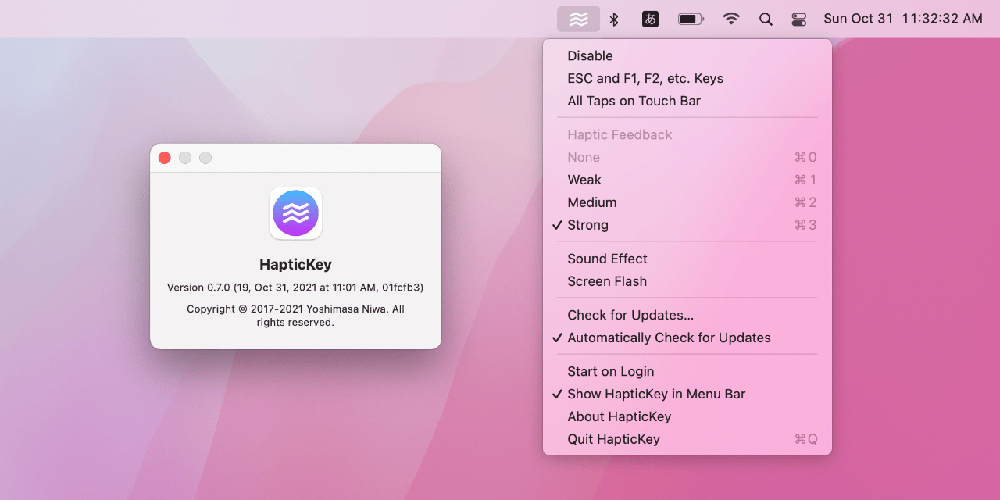
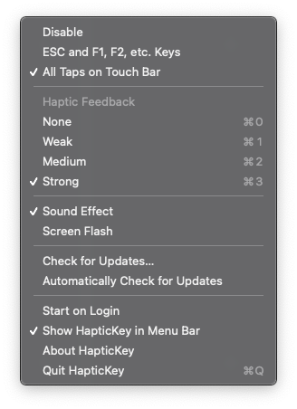

HapticKey
=========

HapticKey is a simple utility application for MacBook with Touch Bar that triggers a haptic feedback when tapping Touch Bar.

Since Touch Bar is just a flat panel, there is no feedback other than a visual change of the key displayed, it is terribly uncomfortable especially when tapping ESC key, like while using Vim.

By adding a haptic feedback, which is vibrating a trackpad not Touch Bar itself, it helps to improve the usage of Touch Bar. It is also optionally playing a sound effect or flashing the screen like a visual bell on a terminal.

Usage
-----

Download the latest pre-built application binary from [Releases](https://github.com/niw/HapticKey/releases) page. Note that these pre-built application binaries are not signed so you need to allow to execute it on Security & Privacy settings pane in System Preferences.

Also, the application may ask a permission to use Accessibility, as like the other applications that are listening system events.

Build
-----

To build the application from the source code, you need to use the latest version of Xcode.

Simply use `make` to install all dependencies, build application binary, then archive it in `build/HapticKey.xcarchive/Products/`.

    $ make

Development
-----------

You can simply open `HapticKey.xcodeproj` to start development of the application.

### Overviews

This application is using `CGEventTap` to listen key down and up or tap events on Touch Bar.

It triggers haptic feedbacks by using private APIs in `MultitouchSupport.framework` when the event meets the conditions.

Currently, the application is listening either ESC and F1, F2, etc. keys or tap events on Touch Bar.
You can implement your own `HTKEventListener` to extend the application to trigger feedbacks on arbitrary events.
